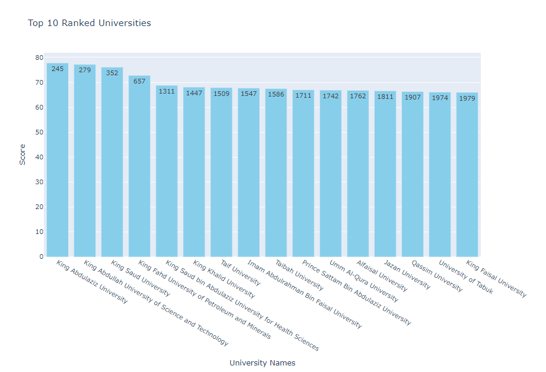
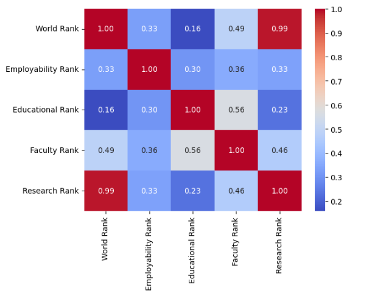
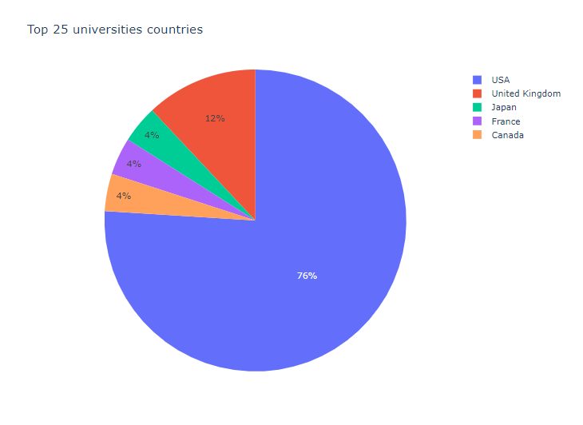
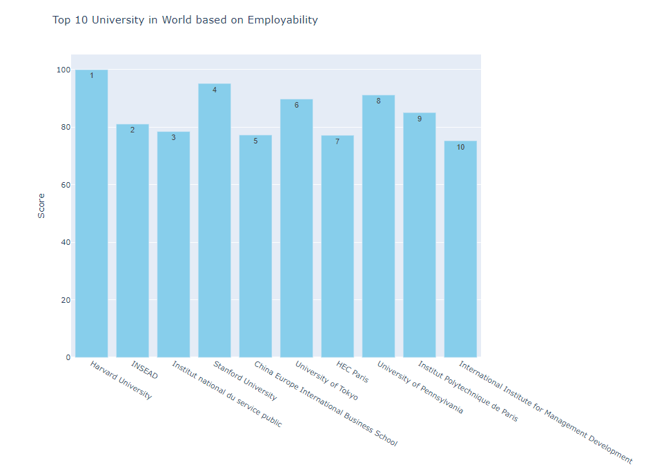

# Usecase-3-Project-2 

##  Team Members
- [Arwa Alkhathlan](https://github.com/arwaalkhathlan)  
- [Taif]()
- [Manal Hanif](https://github.com/ManalHanif)
- [Mohammed Abdullah](https://github.com/Mohammed-Abdullah2)

---

## Introduction
### Problem Statement
This project aims to address **the universties ranking** by analyzing a dataset to uncover actionable insights. The goal is to leverage data analysis techniques to identify patterns, trends, or improvements relevant to their ranks.

### Objectives
1. Understand key features and relationships in the dataset.
2. Apply exploratory data analysis (EDA) techniques.
3. Generate meaningful insights to guide decision-making.

---

##  Dataset Overview
- **Source**: Kaggle,  
- **Description**: This dataset contains information on the ranking of universties.

---

##  Exploratory Data Analysis (EDA) Steps
Below are the key EDA steps applied with brief descriptions:

1. **Data Cleaning**: Handling missing values, duplicates, and outliers.
2. **Data Transformation**: Normalizing or scaling features where necessary.
3. **Univariate Analysis**: Distribution plots for individual variables.
4. **Bivariate and Multivariate Analysis**: Identifying correlations and relationships.
5. **Feature Engineering**: Creating new variables from existing ones.
6. **Handling Categorical Variables**: Encoding methods applied.
7. **Outlier Detection**: Techniques used to identify and treat outliers.
8. **Time-Series or Trend Analysis**: (If applicable) Detecting trends over time.
9. **Visualization**: Charts, heatmaps, and pair plots for better data interpretation.
10. **Statistical Summary**: Key metrics like mean, median, and variance.

---

##  Final Insights and Visualizations
Below are ten key insights derived from the data along with the charts used to illustrate them:

1. **Insight 1**: [the top 10 saudi uni in the global ranking]  
   

2. **Insight 2**: [the corraltion between the diffreant ranks]  
   

3. **Insight 3**: [the top 25 in the global ranking locations]  
   

4. **Insight 4**: [the top 10 employability and their scores]  
   

---

##  Conclusion
This project provides meaningful insights into the unviersties ranking around the world, revealing key patterns such as the top 25 being mainly in USA.

